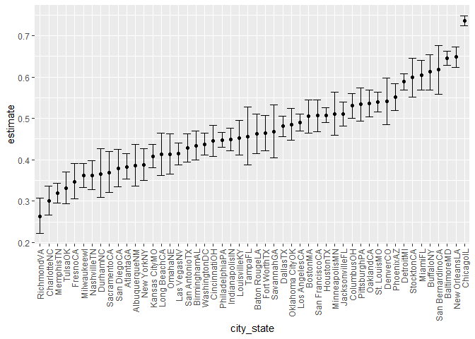

p8105\_hw5\_ar4173
================
Anand Rajan
11/18/2021

## Problem 1

``` r
homicide_df=
  read_csv("./data-homicides/homicide-data.csv", na=c("", "Unknown")) %>% 
  mutate(
    city_state = str_c(city,state),
    resolution = case_when(
      disposition == "Closed without arrest" ~ "unsolved",
      disposition == "Open/No arrest" ~ "unsolved",
      disposition == "Closed by arrest" ~ "solved"
    )
  ) %>% 
  relocate(city_state) %>% 
  filter(city_state != "TulsaAL")
```

Focus on Baltimore, MD

``` r
baltimore_df =
  homicide_df %>% 
  filter(city_state == "BaltimoreMD")

baltimore_summary = 
baltimore_df %>% 
  summarize(
    unsolved = sum(resolution == "unsolved"),
    n = n()
  )

baltimore_test =
  prop.test(
    x = baltimore_summary %>% pull(unsolved),
    n = baltimore_summary %>%  pull(n))

baltimore_test %>% 
  broom::tidy()
```

    ## # A tibble: 1 x 8
    ##   estimate statistic  p.value parameter conf.low conf.high method    alternative
    ##      <dbl>     <dbl>    <dbl>     <int>    <dbl>     <dbl> <chr>     <chr>      
    ## 1    0.646      239. 6.46e-54         1    0.628     0.663 1-sample~ two.sided

Iterate across cities!

``` r
prop_test_function = function(city_df) {
  
  city_summary = 
      city_df %>% 
      summarize(
        unsolved = sum(resolution == "unsolved"),
        n = n()
      )

  city_test =
      prop.test(
        x = city_summary %>% pull(unsolved),
        n = city_summary %>%  pull(n))
  
  return(city_test)
  
}

prop_test_function(baltimore_df)
```

    ## 
    ##  1-sample proportions test with continuity correction
    ## 
    ## data:  city_summary %>% pull(unsolved) out of city_summary %>% pull(n), null probability 0.5
    ## X-squared = 239.01, df = 1, p-value < 2.2e-16
    ## alternative hypothesis: true p is not equal to 0.5
    ## 95 percent confidence interval:
    ##  0.6275625 0.6631599
    ## sample estimates:
    ##         p 
    ## 0.6455607

``` r
homicide_df %>% 
  filter(city_state == "AlbuquerqueNM") %>% 
  prop_test_function()
```

    ## 
    ##  1-sample proportions test with continuity correction
    ## 
    ## data:  city_summary %>% pull(unsolved) out of city_summary %>% pull(n), null probability 0.5
    ## X-squared = 19.114, df = 1, p-value = 1.232e-05
    ## alternative hypothesis: true p is not equal to 0.5
    ## 95 percent confidence interval:
    ##  0.3372604 0.4375766
    ## sample estimates:
    ##         p 
    ## 0.3862434

Iterate across all cities

``` r
results_df =
  homicide_df %>% 
  nest(data = uid:resolution) %>% 
  mutate(
    test_results = map(data, prop_test_function),
    tidy_results = map(test_results, broom::tidy)
  ) %>%  
  select(city_state, tidy_results) %>% 
  unnest(tidy_results) %>% 
  select(city_state, estimate, starts_with("conf"))
```

Plot

``` r
results_df %>% 
  mutate(city_state = fct_reorder(city_state, estimate)) %>% 
  ggplot(aes(x=city_state, y=estimate)) + 
  geom_point() +
  geom_errorbar(aes(ymin = conf.low, ymax = conf.high)) +
  theme(axis.text.x = element_text(angle = 90, vjust = 0.5, hjust=1))
```

<!-- -->

## Problem 2

Calling in the Data files into a data frame

``` r
data_files_df =
  tibble(list.files("./data")) %>% 
  mutate(
    file_list = paste(list.files("./data"))
  )


data_files_df
```

    ## # A tibble: 20 x 2
    ##    `list.files("./data")` file_list 
    ##    <chr>                  <chr>     
    ##  1 con_01.csv             con_01.csv
    ##  2 con_02.csv             con_02.csv
    ##  3 con_03.csv             con_03.csv
    ##  4 con_04.csv             con_04.csv
    ##  5 con_05.csv             con_05.csv
    ##  6 con_06.csv             con_06.csv
    ##  7 con_07.csv             con_07.csv
    ##  8 con_08.csv             con_08.csv
    ##  9 con_09.csv             con_09.csv
    ## 10 con_10.csv             con_10.csv
    ## 11 exp_01.csv             exp_01.csv
    ## 12 exp_02.csv             exp_02.csv
    ## 13 exp_03.csv             exp_03.csv
    ## 14 exp_04.csv             exp_04.csv
    ## 15 exp_05.csv             exp_05.csv
    ## 16 exp_06.csv             exp_06.csv
    ## 17 exp_07.csv             exp_07.csv
    ## 18 exp_08.csv             exp_08.csv
    ## 19 exp_09.csv             exp_09.csv
    ## 20 exp_10.csv             exp_10.csv

Creating a function to read the files in new data frame

``` r
read_files = function(x) {
  
  data = 
    read_csv(paste0("./data/",x)) %>% 
    mutate(file_names = x)
  
}

study_data = map_df(data_files_df$file_list, read_files)
```

Tidying the Longitudinal Study Dataset

``` r
tidy_data = 
  study_data %>% 
  gather(key=week, value = arm_value, week_1:week_8)%>% 
   separate(
    col = file_names,
    into= c("arm","id"),
    sep = "_"
  )  %>% 
  mutate(
    arm = recode(
      arm,
      "con" = "control",
      "exp" = "experimental"
    ),
    id=substr(id,start=1, stop=2), 
    week = str_replace(week,"week_","")
  ) 

tidy_data
```

    ## # A tibble: 160 x 4
    ##    arm     id    week  arm_value
    ##    <chr>   <chr> <chr>     <dbl>
    ##  1 control 01    1          0.2 
    ##  2 control 02    1          1.13
    ##  3 control 03    1          1.77
    ##  4 control 04    1          1.04
    ##  5 control 05    1          0.47
    ##  6 control 06    1          2.37
    ##  7 control 07    1          0.03
    ##  8 control 08    1         -0.08
    ##  9 control 09    1          0.08
    ## 10 control 10    1          2.14
    ## # ... with 150 more rows

Spaghetti Plot

``` r
spaghetti_plot =
ggplot(
  data = tidy_data, aes(x=week, y=arm_value, group=id))+
  geom_line(aes(color=id)) + 
  geom_point(size=0.3) + 
  facet_grid(. ~ arm) +
  labs(
    title= "Arm Values over Time",
      x= "Week",
      y= "Arm Value"
    )

spaghetti_plot
```

<!-- -->

The first major difference is that for participants in the experimental
arm, the arm value generally increased over time. On the other hand, for
participants in the control arm, there is not such a noticeable trend
across time. Secondly, the range of the arm values for the experimental
group is much larger as opposed to the control group.

## Problem 3

Importing Data

``` r
set.seed(10)

iris_with_missing = iris %>% 
  map_df(~replace(.x, sample(1:150, 20), NA)) %>%
  mutate(Species = as.character(Species))
```

Creating function for replacing missing for numeric and character
variables

``` r
replace_missing = function(x) {
  
  if (is.character(x)) {
    
    x[is.na(x)] = "Viriginica"
    
  } else if (is.numeric(x)) {
    
    x[is.na(x)] = mean(x, na.rm=TRUE)
    
  } else stop("Input must be either character or numeric")
  
  return(x)
  
}
```

Running a for loop to call in function to replace missing values in the
iris dataset

``` r
for(i in 1:5) {
  
  iris_with_missing[i] = map(iris_with_missing[i], ~replace_missing(.x))
  
}

iris_with_missing
```

    ## # A tibble: 150 x 5
    ##    Sepal.Length Sepal.Width Petal.Length Petal.Width Species
    ##           <dbl>       <dbl>        <dbl>       <dbl> <chr>  
    ##  1         5.1          3.5         1.4         0.2  setosa 
    ##  2         4.9          3           1.4         0.2  setosa 
    ##  3         4.7          3.2         1.3         0.2  setosa 
    ##  4         4.6          3.1         1.5         1.19 setosa 
    ##  5         5            3.6         1.4         0.2  setosa 
    ##  6         5.4          3.9         1.7         0.4  setosa 
    ##  7         5.82         3.4         1.4         0.3  setosa 
    ##  8         5            3.4         1.5         0.2  setosa 
    ##  9         4.4          2.9         1.4         0.2  setosa 
    ## 10         4.9          3.1         3.77        0.1  setosa 
    ## # ... with 140 more rows
